# AIPND-cn-trial

## 安装

### Step 0 下载实战项目代码

点击本页面右上方的绿色按钮“Clone or download”，然后选择“Download ZIP”下载项目所需代码。

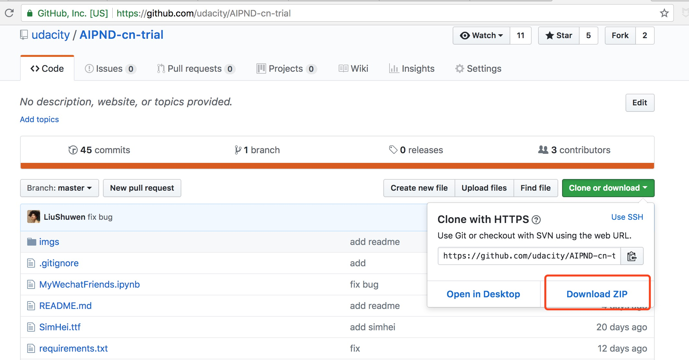

### Step 1 安装Anaconda环境

首先我们需要在Windows系统上安装Anaconda环境，到[官网](https://www.anaconda.com/download)选择一个版本下载，建议选择Python3.6版本，如下图所示：

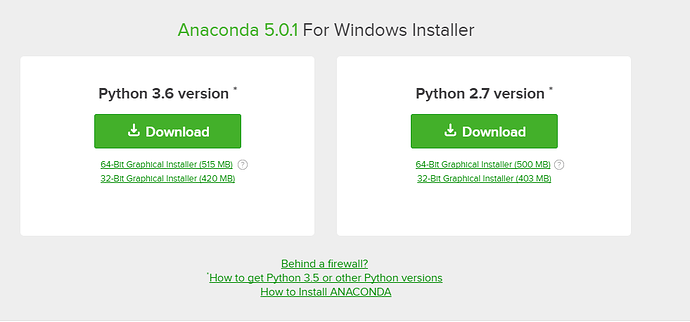

点击运行

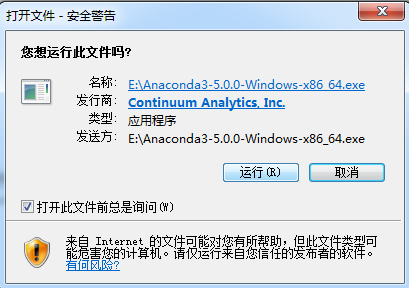

点击next

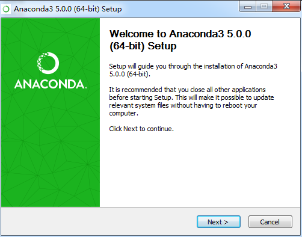

点击I Agree

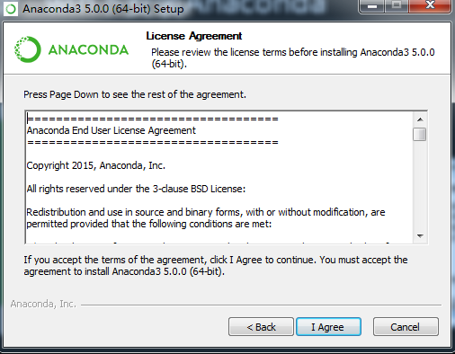

选择All Users，点击Next

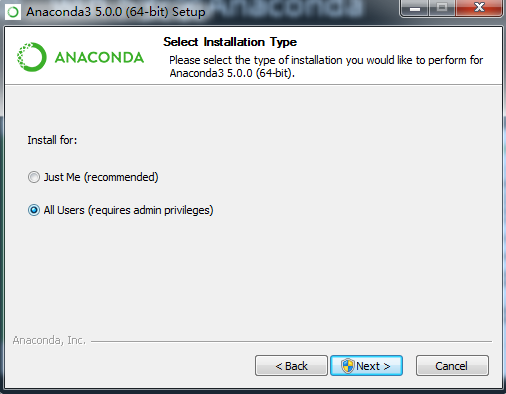

选择安装目录，注意**目录路径不要有中文**，否则容易出现意想不到的错误

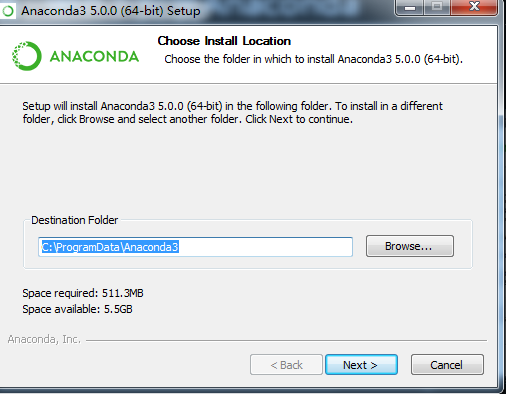

这里全部勾选，点击Install

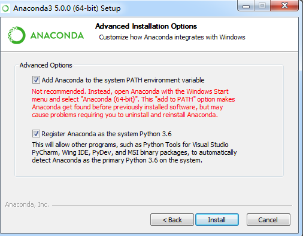

安装过程中，请稍候

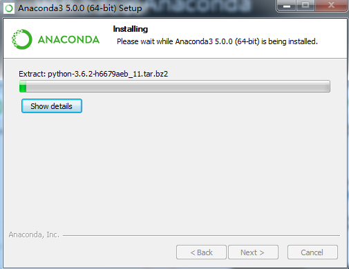

全部勾选，完成安装

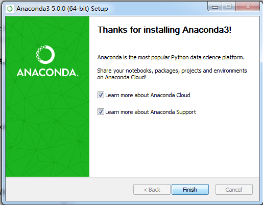

安装完成后在开始菜单中能看到Anaconda项

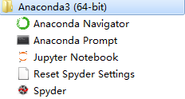

打开上图中的“Anaconda Prompt”，使用CD命令切换到项目源代码所在目录，比如我这里将项目放到了D盘的AIPND-cn-trial-master目录下，那么就使用如下命令进入该目录：

首先切换到D盘，然后进入代码所在目录

输入`d:`然后回车

输入`cd AIPND-cn-trial-master`然后回车

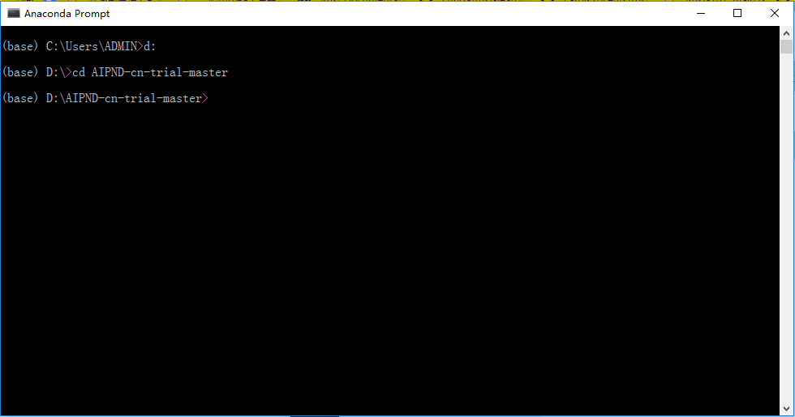

**请学员根据自己存放代码的具体位置修改上述命令**：
1. 先将下载好的项目文件解压，并将解压后的所有文件放到一个方便打开的固定路径下；
2. 说明文档中的d:\AIPND-cn-trial-master就是一个固定路径的例子；
3. 如果你没有将所有解压的文件放到这个路径下，图片中d:\AIPND-cn-trial-master这个路径就是不存在的；
4. 这个路径名你是可以随意更改的，比如你如果将所有解压的文件都放在E盘下的mypath1文件夹下的mypath2目录下，那么这个路径就是e:\mypath1\mypath2；
5. 然后你需要敲的命令如下
    ```
    e: 回车
    cd e:\mypath1\mypath2 回车
    ```

紧接着，使用pip命令，根据项目目录中的requirements.txt安装所需软件包，这些软件包都是通过Python标准包管理工具pip管理的，Anaconda环境可直接使用。

`pip install -r requirements.txt`

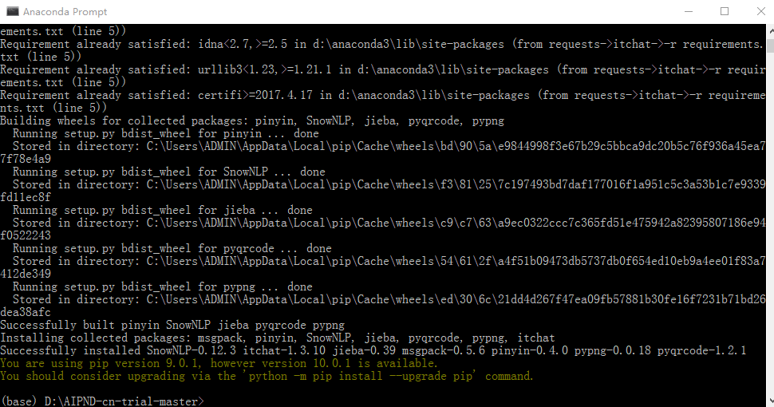

最后，使用conda命令，安装wordcloud软件包，该软件包只能在Anaconda环境（notebook或ipython）中使用。

`conda install -c conda-forge wordcloud`

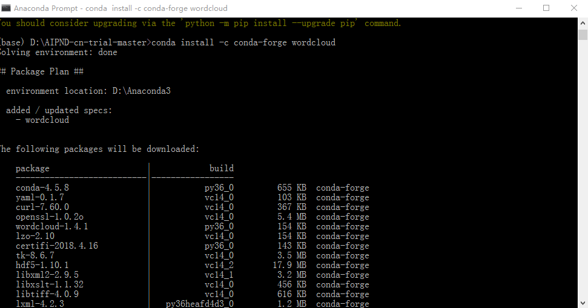

遇到`Proceed ([y]/n)?`，输入y然后回车

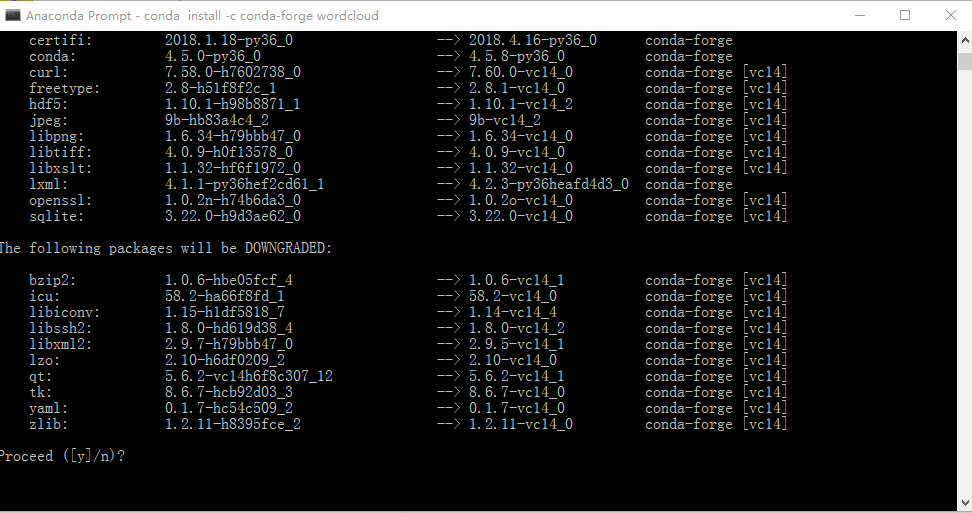

下载和安装软件包过程中，请稍候

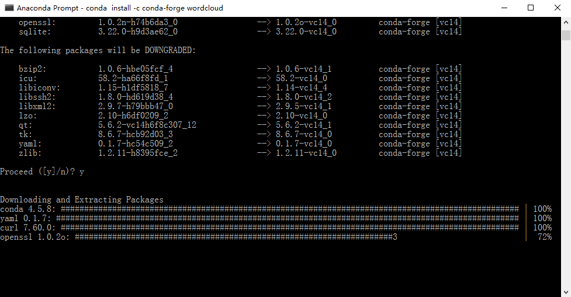

下载完成后，在终端中输入以下命令然后回车，稍等片刻，就可以在打开的浏览器窗口中开始实战项目了！

`jupyter notebook "MyWechatFriends.ipynb"`


## Q&A
**Q1：如何启动Jupyter Notebook？**
A1：Windows：快捷键Win + R打开运行界面，输入cmd，回车打开cmd窗口，窗口中输入'cd 目标路径'代码，如cd G:（进入到目标路径G:下），输入jupyter notebook，打开notebook界面。Mac电脑：同样的操作在Terminal（终端）中执行。

**Q2：如何打开Spyder？**
A2：进入开始菜单，点击Anaconda2/3文件夹，点击Spyder

**Q3：第三方包安装问题**
A3：进入cmd窗口，输入pip install 包名（或conda install 包名），注意这样安装会把包安装到默认环境下，如果已经使用conda分割了环境，如默认环境为myenv1，另一个环境为myenv2，如果需要在myenv2中安装包，需要在cmd中输入activate myenv2，激活对应的环境，然后使用pip install安装。两个环境中的包并不能共享，如果需要两个环境中有相同的包，分别在两个环境中安装，或使用conda重新划分环境。

**Q4：wordcloud包安装**
A4：Step1：在http://www.lfd.uci.edu/~gohlke/pythonlibs/#wordcloud网址下载对应的whl文件（下载whl文件注意要版本对应，查看python版本号，在cmd中输入python --version获得） Step2：cmd窗口cd到whl所在的路径，使用pip install whl文件名安装

**Q5：Jupyter Notebook换到其它浏览器打开需要输入密码。**
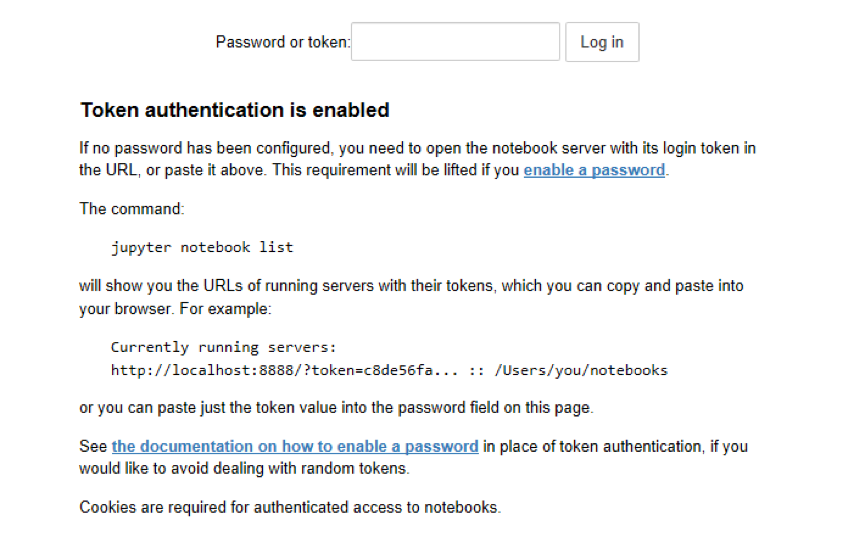
A5：根据下面Token authentication is enabled中的提示进行操作，在cmd界面输入jupyter notebook list，然后右键选择标记token=后面的字符串（或左键选中），使用ctrl + c复制，ctrl + v粘贴在网页中的框内，点击log in登陆。

**Q6：安装项目需要的包**
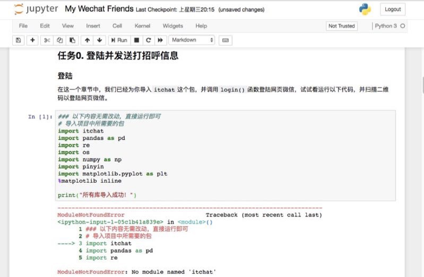

Q7：根据红字提示的信息操作包，No module named 'itchat'说明没有itchat，所以需要pip install itchat。注意在安装SnowNLP，pinyin包时可能会出现中途报错的情况，需要重新输出pip install安装。


